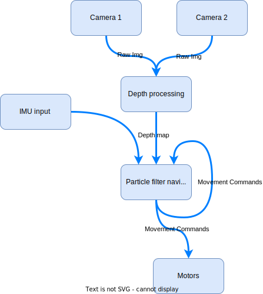
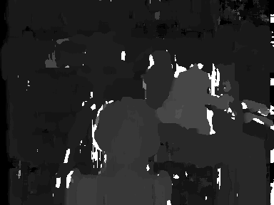

# Navie

A little robot that maps its space autonomously, navigating entirely on its own. Hence the name, Navie.

## Implemented Features

## Desired Features
* Extremely low upfront cost (<$100)
* Stereo camera for navigation
* Use brushless motors as drive system
* Onboard navigation processing
* Onboard vision processing
* Really small (Fit in the palm of the hand)
* Integrated rechargeable battery
* FOC on brushless motors
* Custom motor driver circuit
* WIFI connectivity



## Technologies
Currently being researched. With the intent to run both the stereo image depth processing AND the navigation code onboard, I'm not sure what tech stack will be required. After the stereo image processing code has been written in C, I plan to benchmark it on Raspberry Pi 3, 4, and Picos to determine the feasibility.
https://vision.middlebury.edu/stereo/data/

## Getting Started
TODO write this section

### Dev environment setup
TODO fix this section
* Ubuntu running under WSL with VcXsrv.
* Installing OpenCV is a pain if there isn't already a binary for your system, but this script makes things pretty seamless. I did have to edit the dependencies to get it to work properly, but this is a good place to start.
https://github.com/jayrambhia/Install-OpenCV

git clone https://github.com/opencv/opencv_contrib.git
cd opencv_contrib
git checkout 3.4

sudo cmake -DOPENCV_EXTRA_MODULES_PATH=/mnt/c/Users/Zico/Desktop/opencv_contrib/modules -D CMAKE_BUILD_TYPE=RELEASE -D CMAKE_INSTALL_PREFIX=/usr/local -D WITH_TBB=ON -D BUILD_NEW_PYTHON_SUPPORT=ON -D WITH_V4L=ON -D INSTALL_C_EXAMPLES=ON -D INSTALL_PYTHON_EXAMPLES=ON -D BUILD_EXAMPLES=ON -D WITH_QT=ON -D WITH_OPENGL=ON ..

### Compile
```
gcc -g main.c -o main.o
```

## To-Do

### Depth processing
* Filter output image
* Speed up!!!
* Rectify images (not using Middlebury dataset)

### Misc
* Consider installing a laser pointer to aid in depth perception of featureless walls.

## Benchmarks

Execution time for "depth_processing\tsukuba\scene1.row3.col1.ppm" and "depth_processing\tsukuba\scene1.row3.col2.ppm"

### 2/16/2022
```
287/288 - 100%
block_match() took 90.131191 seconds to execute
```


## Sources
https://medium.com/analytics-vidhya/distance-estimation-cf2f2fd709d8
https://vision.middlebury.edu/stereo/data/
https://towardsdatascience.com/depth-estimation-1-basics-and-intuition-86f2c9538cd1
https://ww2.mathworks.cn/help/visionhdl/ug/stereoscopic-disparity.html
https://citeseerx.ist.psu.edu/document?repid=rep1&type=pdf&doi=32aedb3d4e52b879de9a7f28ee0ecee997003271
https://docs.opencv.org/3.4/d3/d14/tutorial_ximgproc_disparity_filtering.html
http://sintel.is.tue.mpg.de/depth
https://www.cs.cmu.edu/~16385/s17/Slides/13.2_Stereo_Matching.pdf
http://mccormickml.com/2014/01/10/stereo-vision-tutorial-part-i/
https://developer.nvidia.com/how-to-cuda-c-cpp

## Contributions

Contributions are always welcome. If you want to contribute to the project, please create a pull request.

## License

This project is not currently licensed, but I will look into adding a license at a later date.