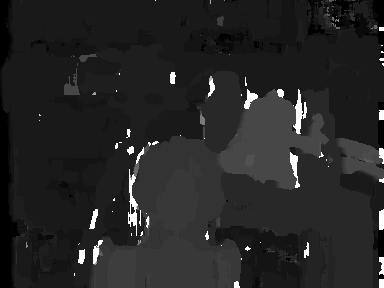
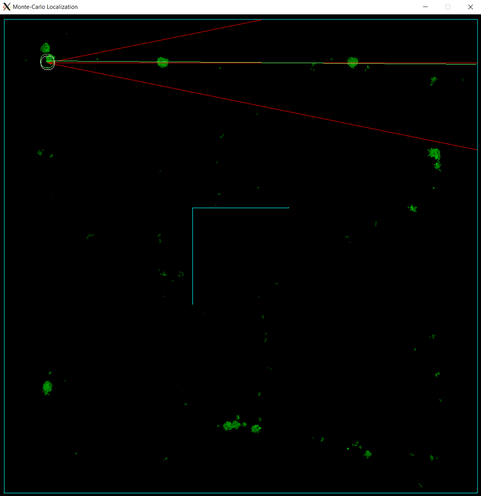

# Navie

A little robot that maps its space autonomously, navigating entirely on its own. Hence the name, Navie.

## Implemented Features

## Desired Features
* Extremely low upfront cost (<$100)
* Stereo camera for navigation
* Use brushless motors as drive system
    * FOC on brushless motors
    * Custom motor driver circuit
* Onboard navigation processing
* Onboard vision processing
* Really small (Fit in the palm of the hand)
* Integrated rechargeable battery
* WIFI connectivity


## Technologies
### Depth processing
Depth processing is done using a block-matching algorithm where each pixel is calculated individually, and neighbors are only processed for sub-pixel calculations. In the future, I plan to implement pyramiding and already have the Gaussian resizing function completed.

### Localization
Localization is currently a simple particle filter, with Gaussian noise generated by this function.

The algorithm has a lot of works still to be done.

### Path planning
The path planning implementation is designed to take a single path with x_1,y_1 start points and x_2,y_2 end points, and recursively split it using an A* approach to generate a valid path.

### Hardware
Currently being researched. With the intent to run both the stereo image depth processing AND the navigation code onboard, I'm not sure what tech stack will be required. After the stereo image processing code has been written in C, I plan to benchmark it on Raspberry Pi 3, 4, and Picos to determine the feasibility.

## Getting Started
TODO write this section

### Dev environment setup
TODO fix this section
* Ubuntu running under WSL with VcXsrv.
* Installing OpenCV is a pain if there isn't already a binary for your system, but this script makes things pretty seamless. I did have to edit the dependencies to get it to work properly, but this is a good place to start.
https://github.com/jayrambhia/Install-OpenCV

git clone https://github.com/opencv/opencv_contrib.git
cd opencv_contrib
git checkout 3.4

sudo cmake -DOPENCV_EXTRA_MODULES_PATH=/mnt/c/Users/Zico/Desktop/opencv_contrib/modules -D CMAKE_BUILD_TYPE=RELEASE -D CMAKE_INSTALL_PREFIX=/usr/local -D WITH_TBB=ON -D BUILD_NEW_PYTHON_SUPPORT=ON -D WITH_V4L=ON -D INSTALL_C_EXAMPLES=ON -D INSTALL_PYTHON_EXAMPLES=ON -D BUILD_EXAMPLES=ON -D WITH_QT=ON -D WITH_OPENGL=ON ..

### Compile

#### Depth processing
```
gcc -g main.c -o main.o
```

#### Localization
```
gcc main.c -O3 -o main.o `sdl2-config --cflags --libs` -lm
```

## To-Do

### Depth processing
* Confidence rejection
* Filter output image
* Rectify images (not using Middlebury dataset)

### Localization
* Particle filter often finds the wrong node cluster at first.
* Particle filter does not take into account recent history.
* Path planner

### Misc
* Consider installing a laser pointer to aid in depth perception of featureless walls. (structured light)

## Benchmarks - Depth processing

Execution time for `depth_processing\tsukuba\scene1.row3.col1.ppm` and `depth_processing\tsukuba\scene1.row3.col2.ppm`. All performance is single threaded to make comparisons to future hardware more apt.

 

### 2/16/2022 Simple block match

```
287/288 - 100%
block_match() took 90.131191 seconds to execute
```


### 2/17/2022 Full-color block match

```
287/288 - 100%
block_match() took 87.297683 seconds to execute
```


### 2/17/2022 Fixed block-matching length issue

```
287/288 - 100%
block_match() took 21.699990 seconds to execute
```


### 2/17/2022 Sup-pixel disparity

```
287/288 - 100%
block_match() took 21.609720 seconds to execute
```


### 2/17/2022 Search-box optimization + better data structure for depth map

```
287/288 - 100%
block_match() took 3.112148 seconds to execute
```


block_match() took 0.682072 seconds to execute

### 2/20/2022 Added -O3 compiler flag and removed unnecessary prints

```
block_match() took 0.682072 seconds to execute
```


## Benchmarks - Localization


### 2/20/2022 Simple particle filter
T-0

T-1

```
processing (not including graphics) took 0.027040 seconds to execute.
```
Execution time is ~0.015s per frame, including path planning and particle filtering with 5000 particles.


## Sources

### Depth processing
Background + source: https://medium.com/analytics-vidhya/distance-estimation-cf2f2fd709d8

Dataset: https://vision.middlebury.edu/stereo/data/

Background: https://towardsdatascience.com/depth-estimation-1-basics-and-intuition-86f2c9538cd1

Background (Research paper): https://citeseerx.ist.psu.edu/document?repid=rep1&type=pdf&doi=32aedb3d4e52b879de9a7f28ee0ecee997003271

Background: https://ww2.mathworks.cn/help/visionhdl/ug/stereoscopic-disparity.html

TODO + Source: https://docs.opencv.org/3.4/d3/d14/tutorial_ximgproc_disparity_filtering.html

Dataset: http://sintel.is.tue.mpg.de/depth

Background: https://www.cs.cmu.edu/~16385/s17/Slides/13.2_Stereo_Matching.pdf

Background: http://mccormickml.com/2014/01/10/stereo-vision-tutorial-part-i/

TODO: https://developer.nvidia.com/how-to-cuda-c-cpp

Background: https://dsp.stackexchange.com/questions/75899/appropriate-gaussian-filter-parameters-when-resizing-image

### Localization

Background (Research paper): https://www.ri.cmu.edu/pub_files/pub1/dellaert_frank_1999_2/dellaert_frank_1999_2.pdf

Background + Source: https://fjp.at/posts/localization/mcl/

Background + Source: https://ros-developer.com/2019/04/10/parcticle-filter-explained-with-python-code-from-scratch/

Background (REALLY GOOD): https://www.usna.edu/Users/cs/taylor/courses/si475/notes/slam.pdf

Example: https://www.youtube.com/watch?v=m3L8OfbTXH0

Background (REALLY GOOD):https://www.youtube.com/watch?v=3Yl2aq28LFQ

## Contributions

Contributions are always welcome. If you want to contribute to the project, please create a pull request.

## License

This project is not currently licensed, but I will look into adding a license at a later date.