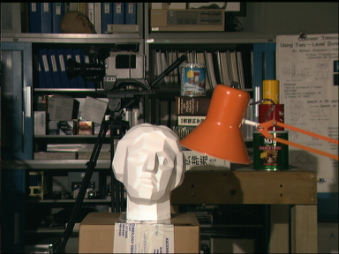

# Navie

A little robot that navigates entirely on its own. Hence the name, Navie.

## Implemented Features
* Onboard navigation processing
* Onboard vision processing

## Desired Features
* Extremely low upfront cost (<$100)
* Stereo camera for navigation
* Use brushless motors as drive system
    * FOC on brushless motors
    * Custom motor driver circuit
* Really small (Fit in the palm of the hand)
* Integrated rechargeable battery
* WIFI connectivity


## Technologies
### Depth processing
Depth processing is done using a block-matching algorithm where each pixel is calculated individually, and neighbors are only processed for sub-pixel calculations. In the future, I plan to implement pyramiding and already have the Gaussian resizing function completed.

### Localization
Localization is currently a simple particle filter, with Gaussian noise generated by this function. Currently, there is no past knowledge within each particle, but there are plans to update this in the future.

The algorithm outputs a "best guess" position on the map that the path planner then uses to attempt to route the robot to the goal location.


### Path planning
The path planning implementation is designed to take a single path with x_1,y_1 start points and x_2,y_2 end points, and recursively split it using an A* approach to generate a valid path. Currently, the path-splitting is buggy so its been removed. Below is a demonstration of the localization and path planning working together to get a robot (white circle with red lines) to the goal position (end of white line) using only the knowledge of the length of the 3 sensors and the map.

You might notice that the green circle/line (the best guess robot) is not correct at first. This is because the map is highly symmetric, so there are lots of valid positions at first


## Hardware
### Processor - Raspberry Pi 4B AND  Raspberry Pi 3 B V1.2
Ideally, this will eventualy be a fully custom processor. However, I've been able to benchmark the processing on a Raspberry Pi 4B and it looks like this will be able to run under a second for a full cycle **without any additional optomizations**. Seeing as 1 second was my initial target when I started this project, this is good enough for now. However, due to my choice of camera, I'll have to run 2 pies. The cameras plug into the pi's camera port, and I don't want to pay for a camera multiplexer. So, the plan is for the Pi 4 to transfer the image to the Pi 3, which will run the depth processing. Then the Pi 3 will output sensor vectors to the Pi 4 which will run the particle filter and the motors.

### Cameras - OV5647 x2
Why these cameras? 1: They are cheap. I managed to find a set of 2 of these on amazon for $9. 2: They are high performing, promising 2592 x 1944 still images, 1080p video, and up to 90 fps at 640x480. What more do I need?

https://www.arducam.com/product/arducam-ov5647-standard-raspberry-pi-camera-b0033/

<image src="images/OV5647.jpg" width=200>

### Motors - N20 knockoff
What do I need in a motor? Encoder feedback, decent build quality, low size and weight. I wanted to get [these](https://www.servocity.com/90-rpm-micro-gear-motor-w-encoder/) from servo city, but I found what looks to be a knockoff on Amazon for half the price. We'll see if I get what I paid for.

<image src="images/motor.jpg" width=200>

https://www.amazon.com/Reduction-Multiple-Replacement-Velocity-Measurement/dp/B08DKJT2XF/ref=sr_1_3?content-id=amzn1.sym.9575273b-ecd8-4648-9bf0-15f20c657e0a&keywords=small+motor+with+encoder&pd_rd_r=fde32aa3-9d35-4a29-bff8-4399a2b25553&pd_rd_w=yEkkM&pd_rd_wg=WBrTI&pf_rd_p=9575273b-ecd8-4648-9bf0-15f20c657e0a&pf_rd_r=EPETC9GXXEZR4B1HBQQV&qid=1677183031&sr=8-3

### Motor controler - L298N
Cheap, reliable, and most importantly cheap.

<image src="images/motor_driver.jpg" width=200>

https://www.amazon.com/HiLetgo-Controller-Stepper-H-Bridge-Mega2560/dp/B07BK1QL5T/ref=pd_day0fbt_vft_none_img_sccl_2/131-7297339-1128516?pd_rd_w=9qlK7&content-id=amzn1.sym.b7c02f9a-a0f8-4f90-825b-ad0f80e296ea&pf_rd_p=b7c02f9a-a0f8-4f90-825b-ad0f80e296ea&pf_rd_r=4H824REAQJ3KVMSXNEC8&pd_rd_wg=C2CHh&pd_rd_r=84f53a42-2846-4393-ba03-d0bd92b40781&pd_rd_i=B07BK1QL5T&psc=1

### Power converter - LM2596
### Integration and cooling


https://banebots.com/banebots-wheel-2-3-8-x-0-4-1-2-hex-mount-50a-black-blue/


## Getting Started
TODO write this section

### Dev environment setup
TODO fix this section
* Ubuntu running under WSL with VcXsrv.
* Installing OpenCV is a pain if there isn't already a binary for your system, but this script makes things pretty seamless. I did have to edit the dependencies to get it to work properly, but this is a good place to start.
https://github.com/jayrambhia/Install-OpenCV

git clone https://github.com/opencv/opencv_contrib.git
cd opencv_contrib
git checkout 3.4

sudo cmake -DOPENCV_EXTRA_MODULES_PATH=/mnt/c/Users/Zico/Desktop/opencv_contrib/modules -D CMAKE_BUILD_TYPE=RELEASE -D CMAKE_INSTALL_PREFIX=/usr/local -D WITH_TBB=ON -D BUILD_NEW_PYTHON_SUPPORT=ON -D WITH_V4L=ON -D INSTALL_C_EXAMPLES=ON -D INSTALL_PYTHON_EXAMPLES=ON -D BUILD_EXAMPLES=ON -D WITH_QT=ON -D WITH_OPENGL=ON ..

 RASPBERRY PI
 ```
 sudo apt install libsdl2-dev
 ```
 sudo apt install liblapacke-dev

### Compile

#### Depth processing
```
gcc -g main.c -o main.o
```

#### Localization
```
gcc main.c -o main.o `sdl2-config --cflags --libs` -lm -O3
```

## To-Do

### Depth processing
* Confidence rejection
* Filter output image
* Rectify images (not using Middlebury dataset)

### Localization
* Particle filter often finds the wrong node cluster at first.
* Particle filter does not take into account recent history.
* Path planner
* Flood on loss of confidence

### Misc
* Consider installing a laser pointer to aid in depth perception of featureless walls. (structured light)

## Benchmarks - Depth processing

Execution time for `depth_processing\tsukuba\scene1.row3.col1.ppm` and `depth_processing\tsukuba\scene1.row3.col2.ppm`. All performance is single threaded to make comparisons to future hardware more apt.

 

### 2/16/2022 Simple block match

```
287/288 - 100%
block_match() took 90.131191 seconds to execute
```


### 2/17/2022 Full-color block match

```
287/288 - 100%
block_match() took 87.297683 seconds to execute
```


### 2/17/2022 Fixed block-matching length issue

```
287/288 - 100%
block_match() took 21.699990 seconds to execute
```


### 2/17/2022 Sup-pixel disparity

```
287/288 - 100%
block_match() took 21.609720 seconds to execute
```


### 2/17/2022 Search-box optimization + better data structure for depth map

```
287/288 - 100%
block_match() took 3.112148 seconds to execute
```


block_match() took 0.682072 seconds to execute

### 2/20/2022 Added -O3 compiler flag and removed unnecessary prints

```
block_match() took 0.682072 seconds to execute
```


## Benchmarks - Localization


### 2/20/2022 Simple particle filter
T-0

T-1

```
processing (not including graphics) took 0.027040 seconds to execute.
```
Execution time is ~0.015s per frame, including path planning and particle filtering with 5000 particles.

## Hardware benchmarks

### Raspberry Pi 3 B V1.2
#### Localization
Software Version: 2d94655dcabb89866f78500f899f6fc5ea158938
```
processing (not including graphics) took 0.522824 seconds to execute
```

### Raspberry Pi 4 B
#### Localization
Software Version: 2d94655dcabb89866f78500f899f6fc5ea158938
```
processing (not including graphics) took 0.190935 seconds to execute
```


## Sources

### Depth processing
Background + source: https://medium.com/analytics-vidhya/distance-estimation-cf2f2fd709d8

Dataset: https://vision.middlebury.edu/stereo/data/

Background: https://towardsdatascience.com/depth-estimation-1-basics-and-intuition-86f2c9538cd1

Background (Research paper): https://citeseerx.ist.psu.edu/document?repid=rep1&type=pdf&doi=32aedb3d4e52b879de9a7f28ee0ecee997003271

Background: https://ww2.mathworks.cn/help/visionhdl/ug/stereoscopic-disparity.html

TODO + Source: https://docs.opencv.org/3.4/d3/d14/tutorial_ximgproc_disparity_filtering.html

Dataset: http://sintel.is.tue.mpg.de/depth

Background: https://www.cs.cmu.edu/~16385/s17/Slides/13.2_Stereo_Matching.pdf

Background: http://mccormickml.com/2014/01/10/stereo-vision-tutorial-part-i/

TODO: https://developer.nvidia.com/how-to-cuda-c-cpp

Background: https://dsp.stackexchange.com/questions/75899/appropriate-gaussian-filter-parameters-when-resizing-image

### Localization

Background (Research paper): https://www.ri.cmu.edu/pub_files/pub1/dellaert_frank_1999_2/dellaert_frank_1999_2.pdf

Background + Source: https://fjp.at/posts/localization/mcl/

Background + Source: https://ros-developer.com/2019/04/10/parcticle-filter-explained-with-python-code-from-scratch/

Background (REALLY GOOD): https://www.usna.edu/Users/cs/taylor/courses/si475/notes/slam.pdf

Example: https://www.youtube.com/watch?v=m3L8OfbTXH0

Background (REALLY GOOD):https://www.youtube.com/watch?v=3Yl2aq28LFQ

Background (Research paper): https://research.google.com/pubs/archive/45466.pdf

Background (REALLY GOOD): https://cs.gmu.edu/~kosecka/cs685/cs685-icp.pdf

Background (Research paper): https://arxiv.org/pdf/2007.07627

Background (Research paper): https://www.researchgate.net/figure/Hybrid-algorithm-ideology-ICP-step-by-step-comes-to-local-minima-After-local-minima_fig4_281412803

https://towardsdatascience.com/optimization-techniques-simulated-annealing-d6a4785a1de7
https://resources.mpi-inf.mpg.de/deformableShapeMatching/EG2011_Tutorial/slides/2.1%20Rigid%20ICP.pdf
https://www.visiondummy.com/2014/04/geometric-interpretation-covariance-matrix/
https://www.youtube.com/watch?v=cOUTpqlX-Xs

### Camera processing
Background: https://www.raspberrypi.com/documentation/computers/camera_software.html#getting-started

Source: https://stackoverflow.com/questions/41440245/reading-camera-image-using-raspistill-from-c-program

Server Stream: libcamera-vid -t 0 --inline --listen -o tcp://0.0.0.0:8000
Server Stream 60fps: libcamera-vid -t 0 --inline --listen -o tcp://0.0.0.0:8000 --level 4.2 --framerate 120 --width 1280 --height 720 --denoise cdn_off

Client: ffplay tcp://10.0.0.73:8000 -vf "setpts=N/30" -fflags nobuffer -flags low_delay -framedrop

## Contributions

Contributions are always welcome. If you want to contribute to the project, please create a pull request.

## License

This project is not currently licensed, but I will look into adding a license at a later date.